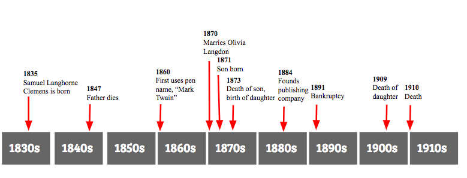

---
header-includes:
- \usepackage{amssymb,amsthm,amsmath}
- \usepackage{chemarr}
output: 
  pdf_documentt:
    fig_height: 3
    fig_width: 5
  pdf_document:
    fig_height: 3
    fig_width: 5
  word_document:
    fig_height: 3
    fig_width: 5
---

<!--
You can delete the header-includes (lines 3-5 above) if you like and also the chunk below since it is loaded in the skeleton.Rmd file.  They are included so that chap2.Rmd will compile by itself when you hit Knit PDF.
-->

```{r include_reedtemplates_2, include = FALSE}
# This chunk ensures that the reedtemplates package is installed and loaded
# This reedtemplates package includes the template files for the thesis and also
# two functions used for labeling and referencing
if(!require(devtools))
  install.packages("devtools", repos = "http://cran.rstudio.com")

if(!require(reedtemplates)){
  library(devtools)
  devtools::install_github("ismayc/reedtemplates")
  }
library(reedtemplates)
```


# The Adventures of Mark Twain {#math-sci}

Now that I've gone through \textit{The Adventures of Tom Sawyer}, I wanted to take a look at Twain's works as a whole (using the six novels stated in **Chapter 1**) and compare them to important milestones in his life.  I'll use the same methods as I did in **Chapter 1**, and in **Chapter 3** I will introduce a different method for textual analysis.  

### Important dates in Twain's life

Twain led a very exciting and inventive life.  When he was young, his family moved to the city of Hannibal, MO.  Hannibal was a frequent stop for steam boats, and it came to be quite the inspiration for Twain later in his works.  Twain was educated at a local private school until he droppped out to become a printer's apprentice, where he discovered his love for writing.  Later in his life, while living in California, Twain met his future wife, Olivia Langdon.  They had one son and three daughters together, only of which one of them would make it to adulthood.  Twain frequently invested in new inventions, and towards the end of his career, he was broke from poor investments.  Below is a timeline of Twain's life in picture format.  

 

### Twain's life as seen through his works

#### Sentiment Analysis


